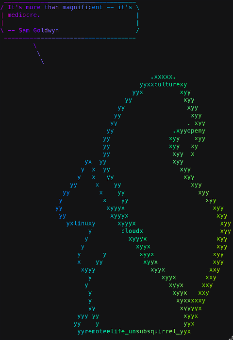

Miscellaneous scripts
=====================

fortune-by-random-char
----------------------

Requirements:

* lolcat
* fortune
* cowsay

Displays an ascii character telling you a random fortune. Optional input
is the cow file path that you want to tell you the fortune.

Example: running with special cow file (otherwise it will select a random default cowsay character).

```bash
fortune-by-random-char ~/cows/unsubsquirrel2.cow
```



Install requirements on Fedora linux 

```bash
sudo dnf install -y lolcat cowsay fortune-mod
```
